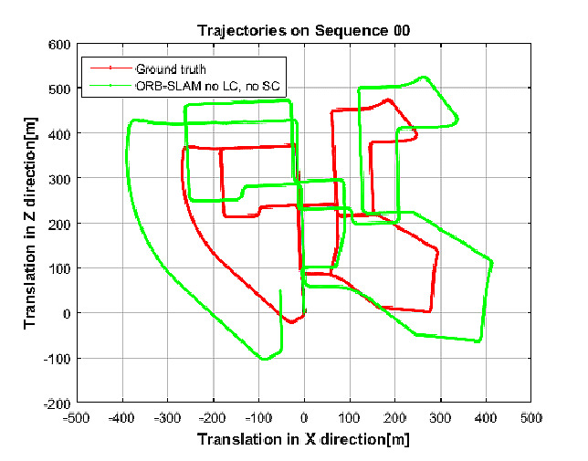
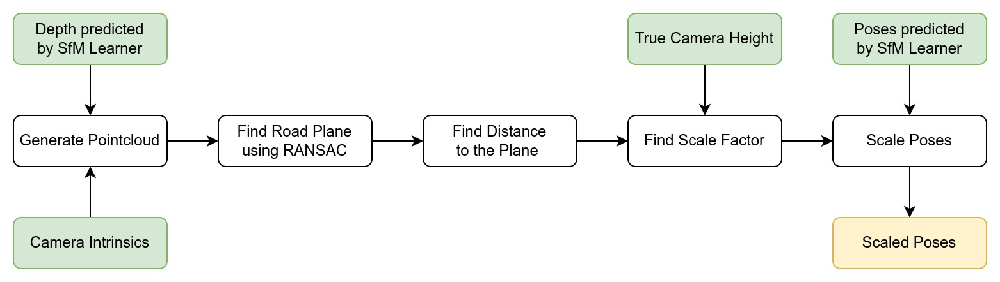

# Visual odometry using a mobile phone monocular camera

**E. Chistov, M. Tregubenko, and S. Linok**

The repository is under development and will be updated

1. [x] Create repository description in README
1. [x] Add Google Colaboratory demo
1. [x] Add proposed method description and results
1. [ ] Add documentation and tests
1. [ ] Think about predicted trajectory length and displacement magnitude
1. [ ] Speed up algorithm

## Overview

Visual odometry is the process of determining the position and orientation of a phone by analyzing the camera images. One of the visual odometry problems is the discrepancy between the scale of the predicted and ground truth trajectory.

This repository contains algorithm to scale trajectory predicted by [SfM Learner](https://github.com/ClementPinard/SfmLearner-Pytorch). For scaling we use metadata such as camera heigth and camera intrinsics.

