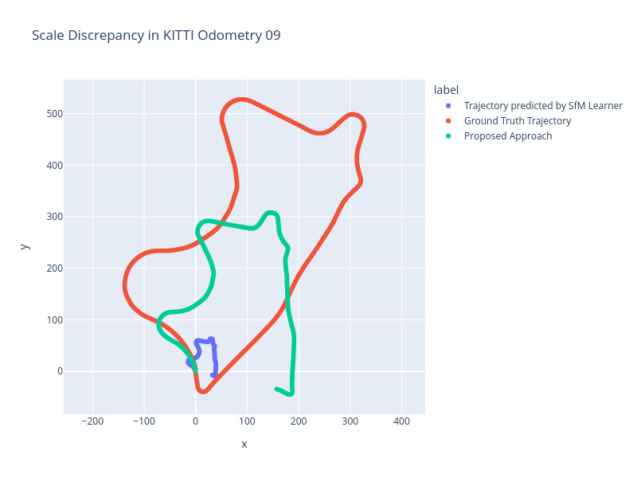

# Scale trajectory predicted by SfM Learner

**E. Chistov, M. Tregubenko, and S. Linok**

## Overview

Visual odometry is the process of determining the position and orientation of a camera by analyzing images.
One of the visual odometry problems is the discrepancy between the scale of the predicted and ground truth trajectory.

This repository contains algorithm to scale trajectory predicted by [SfM Learner](https://github.com/ClementPinard/SfmLearner-Pytorch).
For scaling we use metadata such as camera heigth and camera intrinsics.

